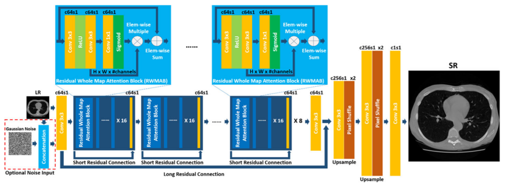

# MedSRGAN
## PyTorch implementation of "MedSRGAN: medical images super-resolution using generative adversarial networks"

</img>

```python
import torch
from generator import Generator
from discriminator import Discriminator

generator = Generator(
      in_channels= 3,
      blocks= 8
)

discriminator = Discriminator(
      in_channels= 3, 
      img_size= (256, 256)
)
```
